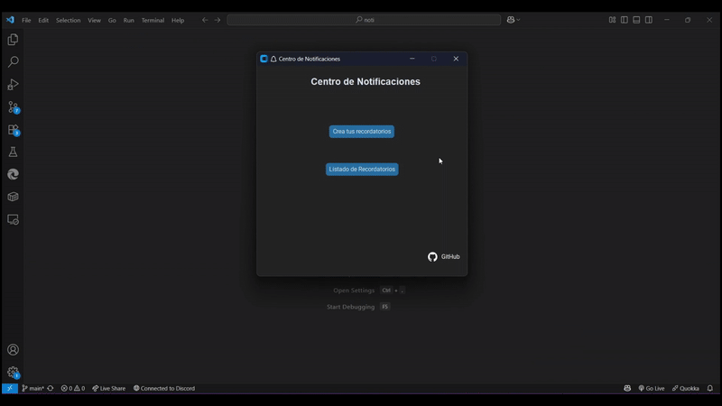
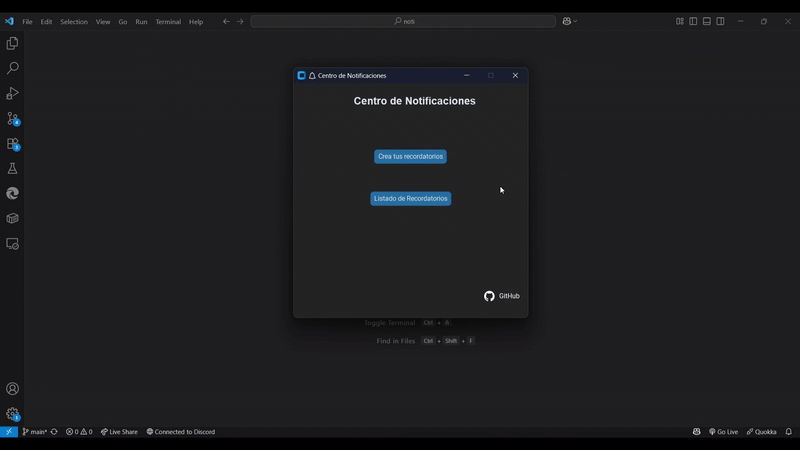
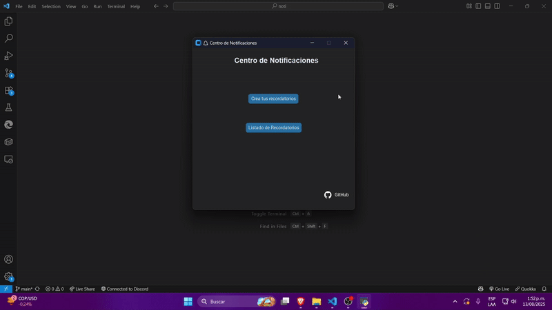

# Reminder App for Windows
        


Forgot an important task? Need a reminder to take a break? The reminder app is the perfect solution for you!
A simple reminder app for Windows that allows you to create, manage, and receive reminders for your tasks and events using Window's Notifications.

> **IMPORTANT:**  
> Make sure that "Do Not Disturb" mode is turned off in your Windows settings. Otherwise, notifications from the reminder app may not appear.
---

## Features:

### Create custom reminders.
Create reminders with personalized messages and your own icons to differentiate them.


### List and delete reminders.
View all your reminders in a list, delete them when they are no longer needed, and keep your schedule organized.


### System tray integration (minimize to the system tray).
Minimize the app to the system tray to keep it running in the background without cluttering your taskbar


---

## Planned Features

- [ ] Edit existing reminders.
- [ ] Save and load reminders.
- [ ] Import and export reminders.
- [ ] Custom notification sounds.
- [ ] Dark/light theme toggle.
- [ ] Run as a standalone `.exe` application.
---

## Installation

### Prerequisites
You need the following to run this project:
- Windows operating system (tested on Windows 11)
- Python 3.13 or higher (see `.python-version`)
- [uv](https://docs.astral.sh/uv/) for managing virtual environments (recommended)

### Setup

1. **Clone the repository:**
   ```bash
   git clone https://github.com/SalomonRN/Reminder-App.git
   cd Reminder-App
   ```

2. **Create and activate a virtual environment, then install dependencies (choose either `uv` or `pip` for this step):**
   If you don't have `uv` installed, you can install it using pip:
   ```bash
   pip install uv
   ```
    Then, use `uv` to create and activate a virtual environment:
    ```bash
    uv venv
    .venv\Scripts\activate
    ```
   Now, install the dependencies:
   ```bash
    uv sync
    ```
   
   Or, if you prefer to use `pip` directly, you can use `venv` module to create a virtual environment.
   ```bash
   python -m venv .venv
   .venv\Scripts\activate
   pip install -r requirements.txt
   ```

---

## Usage

From the project root, run it using `uv`:

```bash
uv run main.py
```
Or, if you are using `pip`:

```bash
python main.py
```
---

## Main Dependencies

- [CustomTkinter](https://customtkinter.tomschimansky.com)
- [schedule](https://schedule.readthedocs.io/)
- [pystray](https://pypi.org/project/pystray/)
- [winotify](https://versa-syahptr.github.io/winotify/docs/winotify.html)

All dependencies are listed in `pyproject.toml`.

---

## License

MIT License

---

## Resources
In this project, we use icons from various sources. Here are some resources where you can find icons:

- [Flaticon](https://www.flaticon.com/)
- [GitHub Icons](https://github.com/logos)

---

Feel free to contribute to this project! Open issues or submit pull requests for any improvements or features you would like